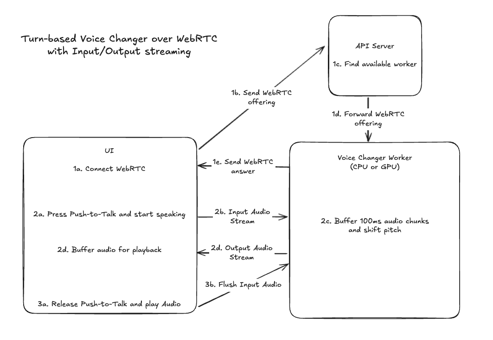

# Voice Changer

A real-time voice changing application with push-to-talk functionality. Built with FastAPI backend and React TypeScript frontend.

## Overview

This project implements a push-to-talk voice changer where users can:

1. Press and hold a button to start recording
2. Release the button to stop recording and automatically process the audio
3. Hear the pitch-shifted version of their voice played back

## Architecture



- **API Server**: FastAPI with WebSocket connections to frontend and worker
- **Voice Changer Worker**: Dedicated FastAPI service for real-time audio processing
- **Frontend**: React TypeScript with push-to-talk WebSocket streaming
- **Audio Processing**: Streaming pitch shifting using librosa with WebM→WAV conversion
- **Real-time Architecture**: Immediate playback while processing continues in background

## Prerequisites

- Python 3.11+
- Node.js 18+
- [uv](https://github.com/astral-sh/uv) (Python package installer)
- [Just](https://github.com/casey/just) (Command runner)

## Quick Start

```
just install # install dependencies
just build # build the go api server
just up # start frontend, api server, and voice changer worker
```

## Testing

```
uv sync --all-extras # install additional test dependencies
just up # start services
uv run test_client.py # tests the api with a sample audio file data/test_input.wav
```

To exercise the frontend end-to-end flow in a real browser, first install the Playwright
Chromium binary and then run the automated test while the stack is up:

```
uv run playwright install chromium
uv run python test_browser.py --record-output temp_audio/remote.webm
```
